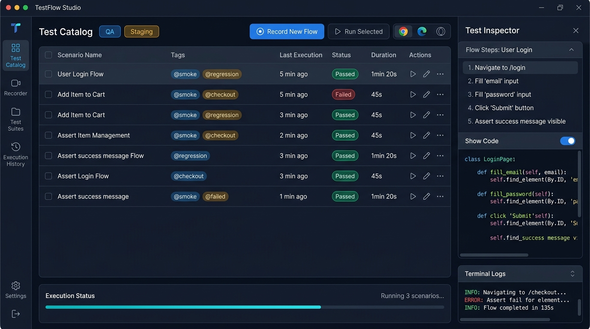

# TestFlow Studio

> **A Standalone Desktop Low-Code / Pro-Code UI Test Automation Framework**  
> Bridging the gap between Functional Testers and Automation Engineers.

---

## 🎯 Vision & Value Proposition

In modern QA teams, functional testers have deep business domain knowledge but lack automation coding skills, while automation engineers spend 70% of their time writing boilerplate locators and translating manual test cases into code.

**TestFlow Studio** solves this with a **Dual-View, Code-First Low-Code Desktop Application**:
1. **Functional Testers** can record end-to-end user journeys via an instrumented browser, tag suites (`@smoke`, `@regression`), parameterize data, and run tests via a simple desktop UI.
2. **The AST Normalization Engine** transforms raw recorded browser actions into clean, maintainable **Page Object Model (POM)** Python/Playwright scripts.
3. **Automation Engineers** can import/export the exact same codebase into standard Git repositories, edit in VS Code / PyCharm, add complex fixtures, and run in CI/CD without proprietary lock-in.

---

## 🖥️ UI Architecture (Desktop App)



### Core UI Modules
- **Top Control Bar:** 1-click `[Record New Flow]`, `[Run Selected]`, environment switcher (`QA` / `Staging` / `Prod`), and browser toggles (Chrome, Edge, Headless mode).
- **Left Navigation:** Test Catalog, Interactive Recorder, Suites & Tags, Execution History, Settings.
- **Central Test Catalog:** Test scenario grid with tags, live pass/fail status badges, duration, and 1-click execution actions.
- **Dual-View Test Inspector (Right Panel):**
  - *Functional View:* Plain English steps (`Navigate to /login`, `Fill email`, `Click Submit`).
  - *Engineer View:* Auto-generated clean Python Page Object Model code with instant "Show Code" toggle.
- **Real-Time Execution Bar (Bottom):** Progress meter, live log streaming, and links to Playwright Traces / Video replays.

---

## 🔄 Bidirectional Import & Export (Zero Lock-in)

- **Export:**
  - Standard Pytest-Playwright / TypeScript-Playwright code files.
  - CI/CD workflows (`.github/workflows/e2e.yml`, GitLab CI, Jenkinsfile).
  - Standalone portable test bundles (`.zip`) and Allure/Playwright HTML executive reports.
- **Import:**
  - Existing Playwright `.py` / `.ts` scripts (reverse-parsed into visual UI steps via AST).
  - Test datasets (`.csv`, `.xlsx`, `.json`) for data-driven testing.
  - BDD Feature files (`.feature` Gherkin format).
  - Direct Git repository clone & pull.

---

## 📦 Packaging & Distribution

- Delivered as a **Single Standalone Executable (`TestFlowStudio.exe`)** with zero installation prerequisites.
- Bundles an embedded Python runtime and taps natively into pre-installed Microsoft Edge / Google Chrome on Windows.

---

## 🚀 Quick Start (Development)

### 1. Install Dependencies
```bash
python -m pip install -r requirements.txt
```

### 2. Launch the Desktop Application
```bash
python app/main.py
```

### 3. Run the Test Suite
```bash
python -m pytest tests/ -v
```

---

## 🗺️ Project Status

- **Phase 1 (Complete):** Core Desktop UI (Edge WebView2), Selector Durability Ranker, AST Normalizer / POM Synthesizer, Pytest Live Execution Runner.
- **Workspace:** `c:\Users\himan\.gemini\antigravity\scratch\TestFlowStudio`

